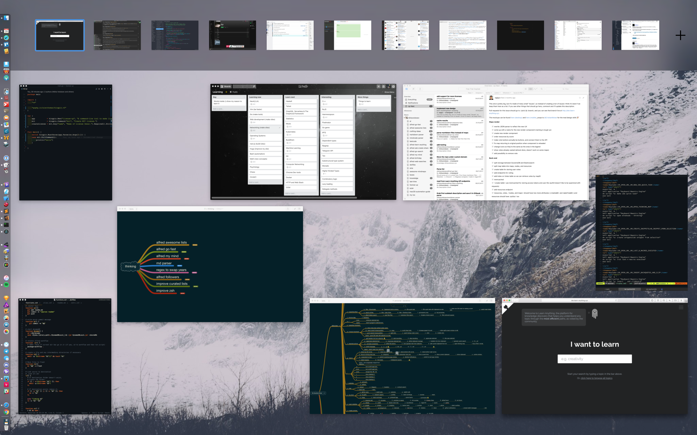
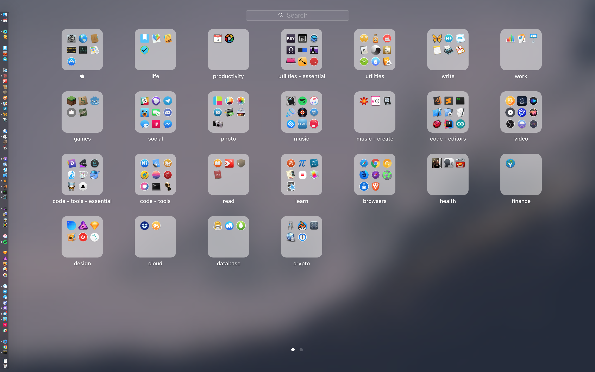
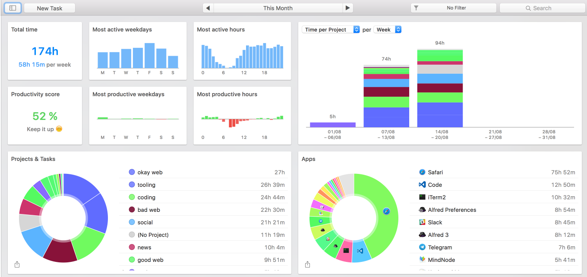

# My wonderful world of macOS 
> A list of applications, alfred workflows and various tools that make my macOS experience even more amazing

> [wallpaper link](https://fotoz.com/wp-content/uploads/2016/10/photo-1414073246499-c5edeb261baa.jpeg)

## Applications
I use a lot of applications on my mac. Here is a list of the ones that I love and use the most in my day to day life, sorted by their importance : 

### 1. [Alfred](https://www.alfredapp.com/) 
- This is by far my favourite application that I have. It saved me a lot of time in my life : 

- And it has a really great [community](http://www.alfredforum.com/) and very powerful [workflows](https://www.alfredapp.com/workflows/) that you can use
- I have attached the ones I use the most to [this repo](https://github.com/learn-anything/alfred-workflows) 
	- feel free to use any that you like
- I also [wrote an article](https://medium.com/@NikitaVoloboev/writing-alfred-workflows-in-go-2a44f62dc432) on how anyone can start developing workflows of their own using Go language

### 2. [MindNode](https://mindnode.com)
- An application which allowed me to create all of the mind maps for [Learn Anything](https://learn-anything.xyz/)
- Tt is an incredible joy to make mind maps in this app and I use it to visualize everything : 
	- [my notes, my projects, my plans, my thoughts](https://medium.com/@NikitaVoloboev/mind-map-everything-d27670f70739#.p7w44kr44)
- I also try to completely bridge the gap between my mind maps and my mind with [this alfred workflow](https://github.com/nikitavoloboev/alfred-my-mind)
- I wrote more about how I use this app [here](https://nikitavoloboev.gitbooks.io/knowledge/content/macOS/apps/Mindnode.html)
	
### 3. [Karabiner](https://pqrs.org/osx/karabiner/) 
- One of the applications I cannot live without, allows me to bind any key that I want. You can take a look at the config files I use for it [here](https://github.com/nikitavoloboev/dotfiles) 
- I go over how I use the app in detail [here](https://nikitavoloboev.gitbooks.io/knowledge/content/macOS/apps/karabiner/Karabiner.html) 
- Karabiner is the only reason I cannot upgrade my mac to Sierra as [Karabiner Elements](https://github.com/tekezo/Karabiner-Elements) still does not have the features I need

### 4. [2Do](http://www.2doapp.com/mac)
- I love [GTD methodology](http://gettingthingsdone.com/fivesteps/), this application is phenomenal with helping me [organise my tasks](https://nikitavoloboev.gitbooks.io/knowledge/content/macOS/apps/2Do.html) and things I want to do and achieve

- It has global quick add with a hotkey :

- Together with lists, priorities, powerful search and a lot more	

### 5. [iTerm](https://www.iterm2.com/) 
- Recently moved completely to using the command line for all my development needs, this is probably the best terminal emulator out there that exists, have it assigned to [w + j](https://nikitavoloboev.gitbooks.io/knowledge/content/macOS/apps/karabiner/sticky-keys.html) and can open it on demand at any time that I want
- [Here](https://gist.github.com/nikitavoloboev/3fbe13ce427132d0297f411b62f49034) are all the [homebrew](http://brew.sh/index.html) packages I like and use 
	- I also really love using [this workflow](https://github.com/isometry/alfred-tty) to quickly switch between iTerm tabs

### 6. [VS Code](https://github.com/Microsoft/vscode)
- My favourite editor that I use to write code in
- Most notably I really like its [vim plugin](https://github.com/VSCodeVim/Vim) 
	- my config for it can be found [here](https://github.com/nikitavoloboev/dotfiles/blob/master/vscode/settings.json) and I describe it in more detail [here](https://nikitavoloboev.gitbooks.io/knowledge/content/text-editors/vs-code.html)

### 7. [SnippetsLab](https://www.renfei.org/snippets-lab/) 
- A very powerful code snippet manager that I have intergrated very heaviliy in my workflow, with [recent addition](https://www.renfei.org/snippets-lab/press-release/whats-new/osx-1.6.html) of its own alfred workflow, [retrieving the snippets](http://i.imgur.com/A4dJbgV.png) that you need it staggeringly fast

- I use it as my [own personal programmer's notepad](https://nikitavoloboev.gitbooks.io/knowledge/content/macOS/apps/SnippetsLab.html) with code and lots and lots of comments

### 8. [Day One](http://dayoneapp.com/) 
- Probably the best journal writing application there is, use it [every day](http://i.imgur.com/V82Em5D.png) to write my [Day Evaluations](https://medium.com/@NikitaVoloboev/day-evaluations-5706f31c9c5e#.5o9j8n48l)

- And [many other small little tidbits of text](https://nikitavoloboev.gitbooks.io/knowledge/content/macOS/apps/day-one.html) with thoughts, plans and experiences that I have had
- If you don't journal, I really suggest you to start, it really is a very powerful mind cleanser and acts as a wonderful history record of your life

### 9. [Typinator](http://www.ergonis.com/products/typinator/) 
- I use the app to [fully automate writing repetetive text](https://medium.com/@NikitaVoloboev/write-once-never-write-again-c2fa1f6c4e8)
- I share the Typinator sets I made with the app [here](https://github.com/nikitavoloboev/typinator-sets) and describe the app in more detail [here](https://nikitavoloboev.gitbooks.io/knowledge/content/macOS/apps/Typinator.html)

#### 10. [1Password](https://1password.com) 
- my password manager of choice, recently started to generate all of my passwords with it and keep everything in a secured and encrypted vault kept secure by my one master password
- no longer need to remember passwords and I now have a unique password for every website that I am signed up on whilist activating two factor authentication wherever possible

#### 11. [Ulysses](http://www.ulyssesapp.com/) 
- all your writing in one place is the motto and the underlying design of the app
- very [powerful search](http://i.imgur.com/Aa17RCQ.png), freedom of structure, great themes and export to markdown / PDF
- I use it to manage writing and managing my [personal wiki](https://nikitavoloboev.gitbooks.io/knowledge/content/) as well as writing [my Medium artciles](https://medium.com/@NikitaVoloboev) that I can then publish in one click from Ulysses
- I write a bit more about how I use the app [here](https://nikitavoloboev.gitbooks.io/knowledge/content/macOS/apps/Ulysses.html)

#### 12. [Pixave](http://www.littlehj.com/) 
- always wanted to organise the mess that my media files were, moving [all of my photographs](http://i.imgur.com/dOZF1gs.png), gifs that I have saved over the years to one place that is easily searchable and is again just a joy to use was very valuable for me
- probably the best application there exists for storing and organising all of your photographic media content
- I write about the app in more detail [here](https://nikitavoloboev.gitbooks.io/knowledge/content/macOS/apps/Pixave.html)

#### 13. [Keyboard Maestro](https://www.keyboardmaestro.com/main/) 
- a staggeringly powerful mac automation tool that I am only beginning to scratch the surface of
- has a [wonderful community](https://forum.keyboardmaestro.com/) that is happy to help with whatever you are trying to achieve
- I go over all my favourite macros I use and how I use them in [here](https://nikitavoloboev.gitbooks.io/knowledge/content/macOS/apps/km/km.html) and I share all the macros I use with the app in a [GitHub repo](https://github.com/nikitavoloboev/km-macros)

#### 14. [BetterTouchTool](https://www.boastr.net/) 
- another amazing application that allows me to quickly map and remap any hotkeys that I use both [globally](http://i.imgur.com/PrDPLki.png) and [app specific](http://i.imgur.com/zyhAaSS.png)
- what more it allows me to also customise [my trackpad gestures](https://medium.com/@NikitaVoloboev/take-control-of-your-touchpad-on-macos-45c581f542e0#.7n1ye6vze) to do any actions that I want, this is very powerful
- I love scrolling through my tabs in Safari with three finger swipes left and right as well as opening and closing tabs with swiping up and down respectively.
	- [here](https://github.com/nikitavoloboev/my-btt) are all the different gestures I have setup to use with the app

#### 15. [PDF Expert](https://pdfexpert.com/) 
- I read a lot of PDFs like books, uni assignments and the like
- this app is a huge upgrade over [Preview](http://www.wikiwand.com/en/Preview_(Mac_OS)) app that I used before
- multiple tabs, sepia mode, very nice annotation tools, great search, performance

#### 16. [Dash](https://kapeli.com/dash) 
- very powerful API documentation browser that allows you to download any docset that you might want to use, search for any method, class or anything that you need very quickly, comes with the amazing [Alfred Worfklow](https://www.alfredapp.com/blog/productivity/dash-quicker-api-documentation-search/) to simplify the process of [searching for the right things](http://i.imgur.com/tBEkKtL.png)

#### 17. [Timing 2](https://timingapp.com/whats-new) 
- I moved completely to Timing 2 from Toggl for both passive and active tracking
- the fact that I can combine active and passive tracking together is quite powerful and allows me to be more aware of where I spend my time 

#### 17. [Airmail](http://airmailapp.com/) 
- by far the most well designed and feature rich mail application that I have used so far, really love all of its simple design, support for multiple accounts and a multitude of nice shortcuts that you can use

#### 18. [Spotify](https://www.spotify.com/us/) 
- found a [lot of great music](https://www.youtube.com/playlist?list=PL0nGxteCFLXYA1fsLmlWzY0Tyoo3c7tF-) with this application and the phenomenal [Alfred Workflow](http://alfred-spotify-mini-player.com/) makes using the application an absolute joy
- quickly finding artists, songs I want to listen, instantly adding the song playing to my 'likes' playlist or any other playlist I want, [seeing what other songs the artist has](http://i.imgur.com/mXUQ51a.png) and more

#### 19. [Fantastical](https://flexibits.com/fantastical) 
- just a straight up best application there is for organising and creating events in your life
- global quick add with a hotkey, natural language input and its great design is what made me switch from an already great Calendar app which comes natively with macOS 
	- I also added some of my own [text expansions](https://medium.com/@NikitaVoloboev/fantastical-natural-input-text-expansions-3ea8cf7ccac3#.pv5937ncr) to help with natural text input
- I wrote more on how I use the app [here](https://nikitavoloboev.gitbooks.io/knowledge/content/macOS/apps/Fantastical.html)

#### 20. [Contexts](https://contexts.co)
- allows me to fuzzy search through [all the currenly active windows](http://i.imgur.com/Z8p8eyn.png) that I have
- makes jumping to the right window I need effortless as I often may have many VS Code instances with different projects

#### 21. [Dictionary](http://www.wikiwand.com/en/Dictionary_(software))
- comes natively with macOS and I started to love using it for exploring and searching through wikipedia
- it is incredibly fast to make the searches and it also gives [quick autosuggestions](http://i.imgur.com/BPOmjkZ.png) for any query I type that I can then select with up and down arrows

#### 22. [Bartender](https://www.macbartender.com/) 
- a great utility app that allows you to customise and hide the contents of your menu bar, really does improve the aesthetics of your OS but also is quite beneficial for me as I customised it to have the [most important information](http://i.imgur.com/2SEANOJ.png) that I need to show in it
	- I can then activate Bartender and [start searching](http://i.imgur.com/K2LbGQv.png) for the menu bar item I need all from the keyboard

#### 23. [Ship](https://www.realartists.com/index.html)
- a really awesome native app that lets me manage my GitHub issues
- can schedule certain issues [as 'up next'](http://i.imgur.com/sQxx9lj.png) and complete them one by one  

#### 24. [Textual](https://www.codeux.com/textual/) 
- recently started to grow a big liking of various cool IRC channels that exist out there, this app is a really wonderful client for all things IRC
- it also has an awesome [channel search](http://i.imgur.com/jwVCcMb.png) feature that I use a lot

#### 25. [Focus](https://heyfocus.com)
- I have hckrnews, reddit, twitter on the black list and have a schedule where I can only use these websites two times in my day, 30 minutes in the morning and 30 minutes in the evening, this acts as my own version of [information diet](https://medium.com/@NikitaVoloboev/news-d6bcaaf40121). Really does make a difference and [helps me focus](http://i.imgur.com/cnVvp3m.png) on what I need to be working on.

#### 26. [Tweetbot](http://tapbots.com/tweetbot/mac/)
- twitter and tweetbot are blocked for me for the majority of the day due to them being a big cause of distraction but the times I do use Twitter, it would be done through this wonderful client that features a timeline without advertisements and one that is synced with the iOS app

#### 27. [YNAB](https://www.youneedabudget.com/) 
- use it to track and overview all of my finances, the most important part of this app is the [ideology](http://classic.youneedabudget.com/method) behind it. The whole app is built around this methodology and I really recommend you take a look at it even if you are not planning to use the app, I find it really freeing and powerful

#### 28. [Reeder](http://reederapp.com/mac/)
- wasn't a big user of RSS but with me finding a lot of great blogs out there, I needed a place to keep myself updated on the great content that they will be posting. 
- Reeder is the best RSS reeder out there that I found

#### 30. [Transmit](https://www.panic.com/transmit/)
- I often use this app to quickly send files from my local file system to the cloud (either S3 or dropbox) and get a shareable link I can send to people
- I use [this alfred workflow](https://www.dropbox.com/s/6y1lwy7lq9njdv6/Transmit.alfredworkflow?dl=1) to [quickly open](http://i.imgur.com/RkkcdvA.png) the cloud storage I need

#### 31. [Transmission](https://www.transmissionbt.com/) 
- a torrent client that I use, very minimal in its UI but is very powerful and has all the features that I need without the bloat that [uTorrent](http://www.utorrent.com/intl/en/) and other clients have
- have all my torrents downloaded into their specific folders
- I also want to set up a seedbox with my raspberry pie in the future as I have a bad tendency of not seeding the torrents that I downloaded

#### 32. [Sketch](https://www.sketchapp.com/) 
- not very fond of subscription based business models but this app is probably the de facto standard in doing any kind of design work on Mac

#### 33. [Pixelmator](http://www.pixelmator.com/mac/) 
- probably the best image editor out there on Mac, is packed with very powerful features and is very simple in its UI

#### 34. [Flux](https://justgetflux.com) 
- a simple utility that makes the screen have nice and warm non blue light emitting colour in the evening
	- as of macOS Sierra, you can use the [built-in feature](https://support.apple.com/en-us/HT207513) by Apple instead

#### 35. [Dropzone](https://aptonic.com) 
- a quick utility that pops up when I drag some file into it or open it with a hotkey, use it to upload images to [Imgur](http://imgur.com), dropping files into a [preset number of folders](http://i.imgur.com/3nWK4b5.png) that I made quickly as well as going to them in an instant) (a great little utility)

#### 36. [Popclip](https://pilotmoon.com/popclip/) 
- another great utility I cannot live without, brings up a quick menu whenever some text is selected on which I can do a number of quick actions, like searching on DuckDuckGo, Youtube, Dictionary, Reddit, Images or it can translate text selected, copy it or say it aloud, here is how [it looks](http://i.imgur.com/6YNy4Uw.png) for me

#### 37. [Next Meeting](https://itunes.apple.com/us/app/next-meeting-menu-bar-app/id1017470484?mt=12) 
- a great menu bar tool that shows me how much time is left until the next event in my calendar
- it has been quite a big addition to my workflow as I know can quickly know how much time is left until my next class or some other event starts

#### 38. [Marked](http://marked2app.com) 
- if I ever need to preview a readme or any other markdown file that I wrote or just want to read, this app is the best application for that I found 
	- it also features live updating and quite a lot of very powerful customisation features

#### 39. [Xcello](http://lingsdesigns.com/xccello/) 

- big fan of [Trello](https://trello.com) as a tool for managing tasks within a team, this app is essentially a web wrapper over online Trello boards

#### 40. [DaisyDisk](https://daisydiskapp.com) 
- a great tool to quickly get a visual glance over what is taking up your disk space and where)

#### 41. [Gemini](http://macpaw.com/gemini) 
- a great little utility to find duplicate files in the system. Didn't get much use of it so far but it may be quite useful on occasions where I do want to clean up my system from useless files and junk

#### 42. [MonthlyCal](https://itunes.apple.com/us/app/monthlycal-colorful-monthly/id935250717?mt=12) 
- a really great [visual representation of my month](http://i.imgur.com/O1UD90S.png) in form of a notification center widget that allows me to see any day I want at a glance as well as what day of month it is and how many events I have in this week

#### 43. [iStat Menus](https://bjango.com/mac/istatmenus/) 
- great system monitoring tools of which I use CPU and storage tracking, I find it very valuable to know if my CPU is being abused by some application and if so by which

#### 44. [Annotate](https://itunes.apple.com/us/app/annotate-capture-screenshot/id918207447?mt=12) 
- best annotation tool I found to exist. After you make a screenshot, it allows for quick edits (arrows, adding some text, blurring parts of the image) as well as ability to quickly save it or drag it to upload to Imgur to share quickly and send the link to anyone I want

#### 45. [BeardedSpice](https://github.com/beardedspice/beardedspice) 
- enhance play/pause as well as previous/next playback keys to not only work in iTunes and Spotify but work for [Soundcloud](https://soundcloud.com/stream), [Youtube](https://www.youtube.com) and many other services

#### 46. [Little Snitch](https://www.obdev.at/products/littlesnitch/index.html) 
- an amazing networking tool that gives you a clear picture of what connections are incoming to your computer and what are outgoing
- takes a bit of time to set it up correctly and is quite an insightful experience first turning it on and having it notify every couple of seconds that some app is trying to send data to some server and whether you want to allow that
- this is essential if you want to take control of what information gets sent out from your computer and what connections have right to connect to your data

#### 47. [Texpad](https://www.texpadapp.com/osx) 
- had to write some LaTeX files for some of my university assignments and in search of a great editor for writing LaTeX I found this and have really enjoyed using it for that task
- has phenomenal suggestions, a great UI interface and live previewing the LaTeX code that you write.)

#### 48. [Slack](https://slack.com) 
- find it to be quite a slow application, given the fact that it is essentially a chrome web application wrapped up with [electron](http://electron.atom.io), it is not much surprise but still it does have some really great features for working and communicating within a team

#### 49. [Telegram](https://desktop.telegram.org/) 
- really dislike [whatsapp](https://www.whatsapp.com) and I quite like Telegram
- it has a very clean interface, a native client for macOS and stickers, privacy is questionable as data is still being sent through Telegram servers but it is still a great chat application)

#### 50. [Anki](http://ankisrs.net) 
- still not fully utilising the full power of [spaced repetition learning](http://www.wikiwand.com/en/Spaced_repetition) but it was one of my goals this year to really start to use this to my advantage. Essentially all this software does is provide you the means to write your own digital flashcards that you can then test yourself on. It also has a lot of [amazing addons](https://ankiweb.net/shared/addons/) that you can get to add more functionality to the app.

#### 51. [ImageOptim](https://imageoptim.com/mac) 
- quickly remove all the unneeded metadata from the image as well as compress images without losing any visual quality and saving a lot of bandwidth when uploading these images on your website or blog

#### 52. [Dragand](http://dragand.watch) 
- quickly get subtitles that I want by dragging the file with the movie/series I want to watch to the app

#### 53. [GIF Brewery](http://gifbrewery.com) 
- allows me to create some great GIFs from video clips as well as converting the entire video clip into a GIF if need be

#### 54. [Noizio](http://noiz.io/) 
- rain, whale noises, coffee shop noises right from my menu bar, when I am tired of listening to music and just want to focus

#### 55. [Sip](https://itunes.apple.com/us/app/sip/id507257563?mt=12) 
- a really great colour picker that is quite often getting updated

#### 56. [Paw](https://paw.cloud) 
- a really great tool for working with API's, only recently started to use it but the features it has are really handy and the design is intuitive and great

#### 58. [IINA](https://github.com/lhc70000/iina)
- open source alternative to VLC built specifically for macOS
- is based on [mpv](https://github.com/mpv-player/mpv) and has a more modern and native look than VLC

#### 59. [Hammerspoon](http://www.hammerspoon.org) 
- really powerul automation engine, wanted to use it for window management at first but found BetterTouchTool to be more performant
- right now I use it show the task I am currenly working on in a little window in the [middle of the screen](http://i.imgur.com/VDjws87.png) for a brief moment
	- can see my config for it [here](https://github.com/nikitavoloboev/dotfiles/blob/master/hammerspoon/init.lua)

#### 60. [Kap](https://github.com/wulkano/kap)

- an open source screen recorder I use to record GIFs 
- has keyboard support so I can quickly start and end recording of the GIF in one hotkey

#### 61. [PodcastMenu](https://github.com/insidegui/PodcastMenu)
- allows you to listen and control playback of podcasts from [Overcast](https://overcast.fm) right from your menu bar

#### 62. [TotalSpaces2](https://totalspaces.binaryage.com/)
- allows me to completely remove the animation of switching between spaces/full screen apps
- now I [run most applications as full screen](http://i.imgur.com/I8JkIi3.png) and switch between them with [Karabiner](https://github.com/tekezo/Karabiner-Elements)

#### 63. [Default Folder X](http://stclairsoft.com/DefaultFolderX/)
- neat little utility I mostly use to [quickly go to various folders](http://i.imgur.com/UOrHiRq.png) from file save windows

#### 64. [Hazel](https://www.noodlesoft.com) 
- use it to fully automate my filing process 
- I use prefixes for everything, bookmarks, notes, ulysses entries and even files 
	- this allows me to write some great rules for my Downloads folder that will file the files where I want them to be
	- [here](http://i.imgur.com/7oiSYV3.png) is one example of such rule 
		- I also recursively lowercase files and hide extensions for all files on my system
		
#### 65. [BitBar](https://github.com/matryer/bitbar)
- can display various things in your menu bar
- I use it to show my current task I am working on with a [simple bitbar plugin](https://i.imgur.com/zh1ZnD3.png) that echoes what I put there
	- I then can [display it with HammerSpoon](https://github.com/nikitavoloboev/dotfiles/blob/master/hammerspoon/init.lua#L57) briefly on my screen to remind myself of what I need to be doing
- I also use it to show a [list of brew services](https://getbitbar.com/plugins/Dev/Homebrew/brew-services.10m.rb) running on my system

## Browser 
My browser of choice is [Safari](http://www.apple.com/safari/). Chrome just kills the battery and Safari is really well optimised for macOS plus I have tried both and I really do find Safari a lot more 'snappier' to use. One powerful plus that chrome does have over safari is the amount of chrome extensions that you can get. Fortunately the ones most needed for me do exist on Safari. 

I keep a list of my favourite Safari extensions and why I love them in a GitHub repository [here](https://github.com/learn-anything/safari-extensions). Feel free to contribute to it if you wish.

I do however use Chrome for web devolopment due to its superior Chrome Dev tools. [Here](https://github.com/learn-anything/chrome-extensions) you can find the chrome extensions I like and use for that.

## Command Line Apps 
[Homebrew](https://brew.sh) is a really wonderful and user friendly package manager for macOS. 

[Here](https://gist.github.com/nikitavoloboev/3fbe13ce427132d0297f411b62f49034) are all the packages I use from it. 

And here are some more command line tools I use and love : 

- [thefuck](https://github.com/nvbn/thefuck) : corrects your previous console command
- [ccat](https://github.com/jingweno/ccat) : [cat](http://www.linfo.org/cat.html) command with colours
- [coreutils](https://www.topbug.net/blog/2013/04/14/install-and-use-gnu-command-line-tools-in-mac-os-x/) : various useful GNU utils that don’t come with macOS
- [ripgrep](https://github.com/BurntSushi/ripgrep) : search text for patterns really fast
- [m-cli](https://github.com/rgcr/m-cli) : useful utils for macOS
- [mas](https://github.com/mas-cli/mas) : cli for mac app store
- [youtube-dl](https://github.com/rg3/youtube-dl) : download videos from youtube and other video sites
- [tmux](https://github.com/tmux/tmux) : terminal multiplexer
- [pandoc](https://github.com/jgm/pandoc) : universal markup converter
- [trash](https://github.com/sindresorhus/trash) : move files and folders to the trash
- [vtop](https://github.com/MrRio/vtop) : graphical activity monitor
- [curl](https://github.com/curl/curl) : transfer data, supports various protocols
- [howdoi](https://github.com/gleitz/howdoi) : instant coding answers
- [asciinema](https://github.com/asciinema/asciinema) : terminal session recorder
- [tldr](https://github.com/tldr-pages/tldr) : simplified and community-driven man pages 
- [imgcat](https://github.com/eddieantonio/imgcat) : like [cat](http://www.linfo.org/cat.html) but for images
- [screenfetch](https://github.com/KittyKatt/screenFetch) : fetches system/theme information in terminal
- [hugo](https://github.com/gohugoio/hugo) : fast and flexible static site generator
- [coala](https://github.com/coala/coala) : linting and fixing of code
- [reflex](https://github.com/cespare/reflex) : run a command when files change
- [create-react-app](https://github.com/facebookincubator/create-react-app) : create React apps with no build configuration
- [now](https://github.com/zeit/now-cli) : realtime global deployments served over HTTP/2
- [yarn](https://github.com/yarnpkg/yarn) : fast, reliable, and secure dependency management
- [iStats](https://github.com/Chris911/iStats) : system stats from the command-line
- [alfred](https://github.com/jason0x43/go-alfred#installation) : symlinks your go project to alfred directory and builds your workflow
- [license up](https://github.com/nikitavoloboev/license-up) : create a license quickly for your project
- [fzf](https://github.com/junegunn/fzf) : command-line fuzzy finder
- [exa](https://github.com/ogham/exa) : replacement for ls written in rust

## [Alfred Workflows](https://github.com/learn-anything/alfred-workflows)
I find [Alfred](https://www.alfredapp.com) with its ability to create custom workflows for it to bring me the most value. 

I keep a list of my favourite workflows and why I love them in a GitHub repository [here](https://github.com/learn-anything/alfred-workflows). Feel free to contribute to it if you wish.

## Desktop Screenshot 
> sf is alias for [screenfetch](https://github.com/KittyKatt/screenFetch)

## Launchpad

## Timing Screenshot 

## [My wonderful world of iOS 📱](https://github.com/nikitavoloboev/my-ios)
If you found this interesting, I also have [similar repository](https://github.com/nikitavoloboev/my-ios) going over what applications I use on iOS as well as how and why I use them.

    

## Similar Setups 
Here you can find more setups by other people that you can take ideas and inspiration from. Feel free to contribute to this list and add your own setups.

- [works for me](https://works-for-me.github.io/) : collection of developer toolkits 
- [Use This Interviews](https://usesthis.com) : what do people use to get stuff done?

## Thank you 💜
You can support what I do on [Patreon](https://www.patreon.com/nikitavoloboev) or look [into other repositories](https://my.mindnode.com/ZKGETDkUaQUsL3q8q9z788CxG84oEHgDiT79GuzX#-143.5,-902.6,0) I shared. 